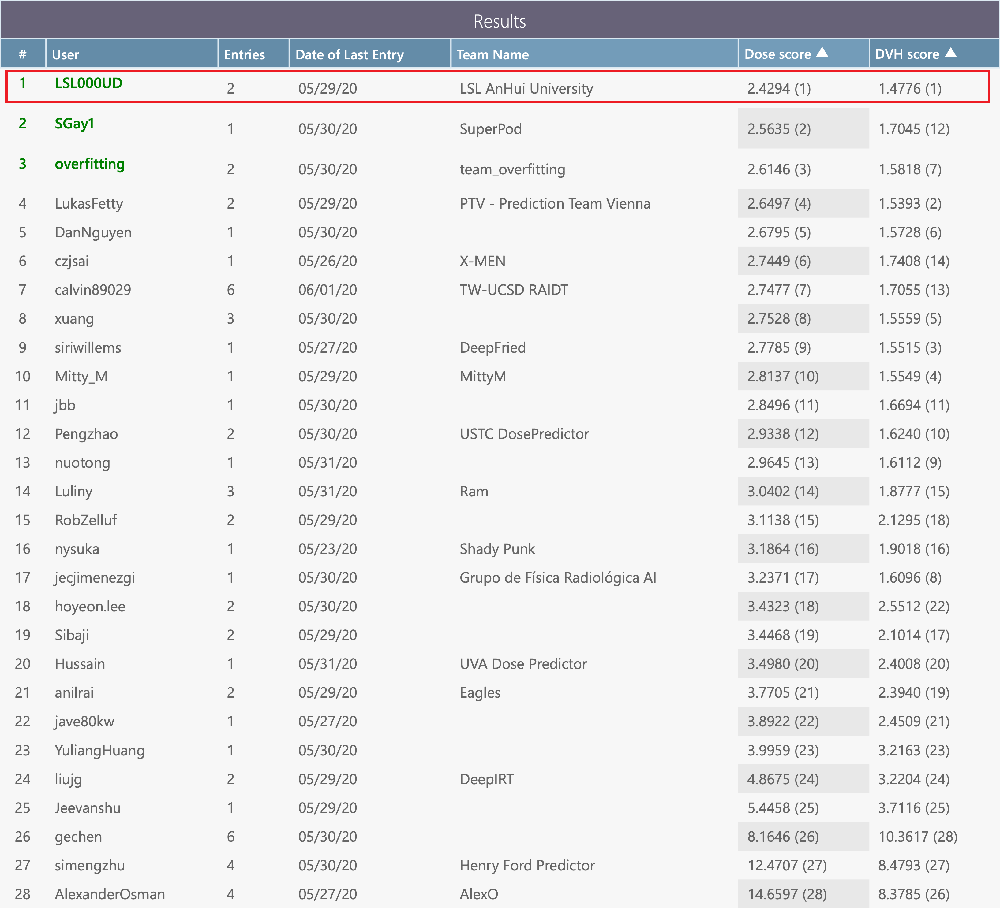

# RTDosePrediction
Automatic Radiotherapy Treatment Planning ， Knowledge-Based Planning ， Dose Prediction ， Cascade 3D Network (C3D) ，DCNN,  Head and Neck , 
1st Place Solution to the AAPM OpenKBP challenge

## Overview
This repository contains an PyTorch implementation for radiotherapy dose prediction, along with pre-trained models and examples.

The goal of this implementation is to be simple, highly extensible, and easy to integrate into your own projects. This implementation is a work in progress -- more dose prediction models are currently being implemented. Currently support：

- C3D, a cascade 3D network for radiotherapy dose prediction, the 1st place solution to the AAPM OpenKBP challenge

- [DCNN](https://doi.org/10.1088/1361-6560/aba87b), a lightweight and accurate dose prediction method

## Performance
- Results on OpenKBP **test set** using a **Single model** with test-time augmenation(TTA)

| Model | Batch  size | GPU memory | Training   iterations | Training time |   Dose score|  DVH score|Pre-trained Models|
|-----| :------------: | :----: | :----: | :----: |:----: |  :------------: |:----: |
| C3D (3D) | 2 | 18Gb | 80,000 | 50 hours|  **2.46** |**1.58** |  [Google Drive](https://drive.google.com/file/d/1OFctP-Q_gKTj93kPbhRDIcW4jpN1cltv/view?usp=sharing)|
| [DCNN](https://doi.org/10.1088/1361-6560/aba87b) (2D) | 32 | **3Gb** | 100,000 | **20** hours |  2.75 |1.68 | [Google Drive](https://drive.google.com/file/d/1dWOYf7rmmyxco5pF75j8Qqt6U9ZmsmhK/view?usp=sharing)|

- OpenKBP leadboard

 

## Usage
1. Data Preparation
	- Download [OpenKBP challenge repository](https://github.com/ababier/open-kbp), and copy the repository to `/path_to_RTDosePrediction/RTDosePrediction/Data/`
    - C3D：

      ~~~
      cd /path_to_RTDosePrediction/RTDosePrediction/Src/DataPrepare
      python prepare_OpenKBP_C3D.py
      ~~~

   - DCNN：

      ~~~
      cd /path_to_RTDosePrediction/RTDosePrediction/Src/DataPrepare
      python prepare_OpenKBP_DCNN.py
      ~~~

2. Training
	- C3D：

      ~~~
      cd /path_to_RTDosePrediction/RTDosePrediction/Src/C3D
      python train.py --batch_size 2 --list_GPU_ids 1 0 --max_iter 80000
      ~~~
	- DCNN：

      ~~~
      cd /path_to_RTDosePrediction/RTDosePrediction/Src/DCNN
      python train.py --batch_size 32 --list_GPU_ids 0 --max_iter 100000
      ~~~

3. Testing

	- C3D：

      ~~~
      cd /path_to_RTDosePrediction/RTDosePrediction/Src/C3D
      python test.py --GPU_id 0 
      ~~~
    
	- DCNN：
      ~~~
      cd /path_to_RTDosePrediction/RTDosePrediction/Src/DCNN
      python test.py --GPU_id 0 
      ~~~

4. Using pre-trained models

	- Download model weights for [C3D](https://drive.google.com/file/d/1OFctP-Q_gKTj93kPbhRDIcW4jpN1cltv/view?usp=sharing) and [DCNN](https://drive.google.com/file/d/1dWOYf7rmmyxco5pF75j8Qqt6U9ZmsmhK/view?usp=sharing)
	- Copy model weights to `/path_to_RTDosePrediction/RTDosePrediction/PretrainedModels`

	- C3D：
      ~~~
      cd RTDosePrediction/Src/C3D
      python test.py --GPU_id 0 --model_path ../../PretrainedModels/C3D_bs2_iter80000.pkl
      ~~~
	- DCNN：
      ~~~
      cd RTDosePrediction/Src/DCNN
      python test.py --GPU_id 0 --model_path ../../PretrainedModels/DCNN_bs32_iter100000.pkl
      ~~~

## Requirements
- torch >=1.2.0
- tqdm
- opencv-python    4.3.0.36
- numpy
- SimpleITK 
- pandas
- scikit-image
- scipy

## Citation
~~~
@article{C3D,
   title = {Cascade 3D Network for Radiotherapy Dose Prediction : 1st Place Solution to OpenKBP Challenge},
   author = {Shuolin Liu and Jingjing Zhang and Teng Li and Hui Yan  and Jianfei Liu},
   journal = {Medical Physics, under review}
}

@article{DCNN,
   title = {Predicting voxel-level dose distributions for esophageal radiotherapy using densely connected network with dilated convolutions},
	doi = {10.1088/1361-6560/aba87b},
	url = {https://doi.org/10.1088%2F1361-6560%2Faba87b},
	year = 2020,
	month = {oct}, 
	publisher = {{IOP} Publishing},
	volume = {65},
	number = {20},
	pages = {205013},
	author = {Jingjing Zhang and Shuolin Liu and Hui Yan and Teng Li and Ronghu Mao and Jianfei Liu},
	journal = {Physics in Medicine {\&} Biology
}
~~~
## Acknowledgement
- https://github.com/ababier/open-kbp

